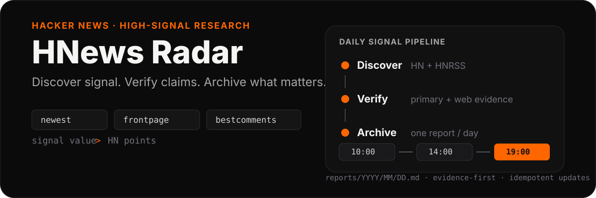

<p align="center">
  
</p>

# HNews Radar

> 把 Hacker News 的瞬时热度，变成可验证、可回溯、可长期积累的高信号研究档案。

HNews Radar 每天自动扫描 Hacker News，筛出真正值得关注的技术、产品、项目、工具和讨论，再回到原始资料与互联网证据做二次核验。完整研究结果按日期写入仓库；聊天只保留短摘要，避免上下文不断膨胀。

**核心原则：`Signal Value > HN Points`。**

## What you get

每个工作日持续维护同一份日报：

```text
10:00  上午基线
  ↓
14:00  真实增量
  ↓
19:00  晚间收盘 + 当日最终判断
  ↓
reports/YYYY/MM/DD.md
```

一次运行重点寻找：

- **强信号** — 会改变技术、产品、商业或产业判断的真实新信息；
- **项目与工具** — 新 repo、开发者工具、基础设施、产品、Demo，包括低热度早期项目；
- **热点讨论** — 评论区信息量高于原文的争论、实践经验和反例；
- **反直觉观点** — 能推翻标题直觉、改变问题理解方式的证据；
- **机会信号** — 产品、定价、分发、成本结构、开发者工作流和创业机会。

## Evidence first

每个正式信号都必须能一路点回原始材料。

典型条目包含：

```markdown
Source:   原文 / 项目 / 论文 / 官方公告 / Docs / Release / Commit
HN:       Hacker News discussion
Evidence: 支持证据、反证、关键评论、独立来源
Type:     verified_fact / author_claim / community_evidence / inference / unknown
```

没有原始 URL 的内容不会进入正式强信号；无法补齐证据时只能保留为 `unknown / 待验证`。

项目和工具通常要求 **2–5 条可点击证据链**：

1. HN discovery / discussion；
2. 一手来源：repository、README、release、commit、docs、paper、official post、demo；
3. 独立互联网证据：benchmark、技术讨论、用户实践、adoption、prior art、竞品对比或第三方报道。

搜索结果页不能替代原始来源。能找到一手资料时，不用二手转述代替。

## Project & Tool Radar

HNews Radar 不把 Star、Points 或“是否作者自荐”当门槛。一个只有几十个 Star、刚刚发布的项目，只要问题抓得准、实现聪明或体现新的工作流，也可以进入 `early-potential`。

每个入选项目至少回答：

- 它解决什么具体问题？
- 为什么现在值得关注？
- 真正有意思的是产品洞察、架构、交互还是工程技巧？
- 相比已有方案新在哪里？
- HN 里大家具体在争论什么？
- 最强的限制、反证或未证实点是什么？
- 有没有值得复制的产品机会或工程模式？

Signal class：`strong` · `worth-watching` · `early-potential` · `unverified`

## Hot Discussions

报告会单独检查 Hacker News 评论，而不是只读文章标题。

重点保留：

- 评论比原文更有价值的线程；
- 有证据支撑的专业分歧；
- 意外的真实使用案例；
- 推翻标题直觉的关键评论；
- points/comments 快速上升且讨论质量同步提高的话题；
- 多个独立帖子或评论共同指向的趋势。

关键判断尽量直接链接到具体 HN comment permalink，方便之后回看争论是怎么形成的。

## Daily archive

```text
reports/
  YYYY/
    MM/
      DD.md
```

一天只有一个 Markdown 文件。10:00、14:00、19:00 对同一文件做幂等更新，不重复追加同名章节。

14:00 / 19:00 只有发生真实变化才重新覆盖已有主题，例如：

- 新的一手材料或官方回应；
- 新 release / commit / benchmark / data；
- HN 讨论质量明显提高；
- 出现强反例或关键评论；
- `unverified → verified`；
- 重要纠错或事实冲突；
- 新的产品、商业或工程含义。

仅仅 Points 继续缓慢上涨，不构成重复报道理由。

## Sources scanned

固定发现层：

- [HNRSS · newest](https://hnrss.org/newest)
- [HNRSS · best comments](https://hnrss.org/bestcomments)
- [HNRSS · front page](https://hnrss.org/frontpage)
- [HNRSS · newest 300+ points](https://hnrss.org/newest?points=300)
- [Hacker News](https://news.ycombinator.com/)

HN / RSS 负责发现，最终判断继续追到原文、项目、论文、官方文档、代码、Release 及其他可靠互联网来源。

## Repository as memory

这个仓库是自动化任务的**唯一长期状态源**。

每次运行会先读取：

1. [`REPORT_SPEC.md`](./REPORT_SPEC.md)；
2. 当天已有报告；
3. 前一天报告。

随后再决定什么属于新增、什么已经覆盖、什么需要纠错。任务不依赖旧聊天正文维持连续性。

完整报告留在 GitHub；定时任务在聊天中只返回运行时间、报告路径、信号数量、1–3 条 takeaway 和 commit SHA。

## Report contract

完整的章节结构、证据标签、增量规则、链接要求和写入约束见 [`REPORT_SPEC.md`](./REPORT_SPEC.md)。它是每次自动运行的持久契约。
